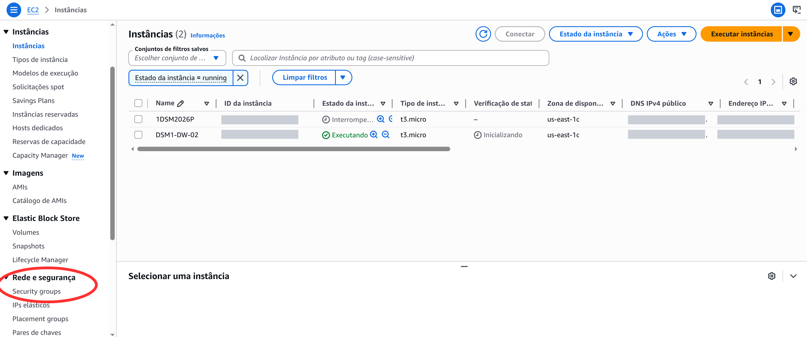
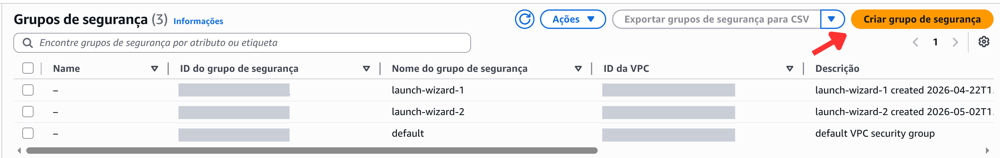
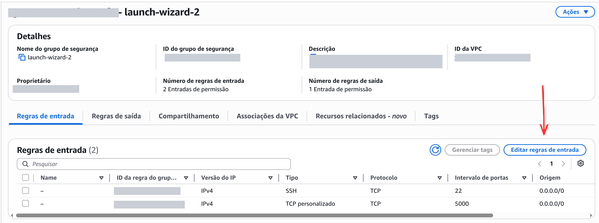
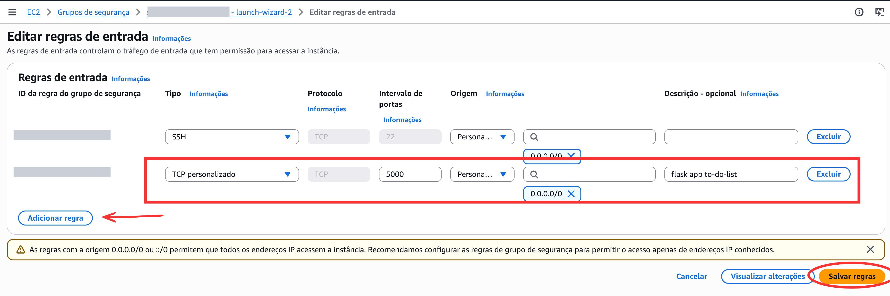

1. Com a instância iniciada, rode o comando: 

``` shell
git clone https://github.com/jeancosta4/to-do-list.git
```

Esse comando clona o repositório, criando uma cópia idêntica do projeto no seu servidor remoto (instância EC2 da AWS) - baixando os arquivos para o disco rígido da instância na nuvem. Ou seja, não precisa se preocupar em mudar itens do repositório aqui, pois o que você alterar não irá alterar o repositório no git do professor! 

2. Entre na pasta do projeto

``` shell
cd to-do-list
```

3. Em seguida, vamos ativar o ambiente virtual. 

``` shell
python3 -m venv venv # cria o ambiente virtual
. venv/bin/activate # ativa o ambiente virtual
```

**Porque usar ambiente virtual?**

Cada aplicação funciona de uma forma diferente e utiliza versões diferentes de biblioteca que podem conflitar. Usar `venv` é uma das práticas fundamentais para evitar problemas no gerenciamento de dependências. Isso evita, por exemplo, que a instalação de um pacote para um projeto X sobrescreva uma versão necessária para o projeto Y, o que certamente traria muitos problemas.

Por exemplo, o Projeto X precisa de `Flask 1.0` e o projeto Y precisa de `Flask 3.0`. O `venv` permite que ambas coexistam na mesma máquina sem interferências.

4. Instalação de pacotes necessários para a aplicação

Por convenção, utiliza-se o arquivo `requirements.txt` como uma espécie de lista de compras técnicas para o projeto. 

Ele garante que qualquer pessoa instale exatamente as mesmas versões das bibliotecas que usamos para desenvolver o código, replicando e padronizando nosso ambiente. 

Além disso, ele permite que instalemos dezenas de dependências com um único comando, ao invés de fazê-las manualmente. 

``` shell
pip install -r requirements.txt
```

Obs: no meu caso em específico recebi retorno de erro de `Exception: Can not find valid pkg-config name`. Isso acontece porque o pacote mysqlclient (uma dependência do Flask-MySQLdb) precisa ser compilado durante a instalação, e para isso ele exige algumas bibliotecas do sistema (C e MySQL) que não estão instaladas no meu Ubuntu. No meu caso, o problema foi resolvido com o comando:

```
sudo apt update
sudo apt install python3-dev default-libmysqlclient-dev build-essential pkg-config -y
```

5. Adicionar regra de entrada (Inbound Rule) na AWS
- em `Rede e Segurança` selecionar `Security groups` .

- Selecionar o grupo de segurança vinculado à sua instância. 




Obs: caso você não saiba qual é, vá em `Instâncias`, clique no `ID da instância`, que estará em azul. Irá abrir uma nova página. Clique na aba `Segurança` e na opção `Grupos de Segurança` verifique qual grupo está vinculado. Se não houver, você precisará clicar no botão direito laranja que aparece na página de `Grupos de Segurança` - como no print abaixo - em `Criar grupo de segurança`.




Ao selecionar o grupo de segurança você será levado para esta nova página.




Clique em `Editar regras de entrada`.



Clique em `Adicionar regra` - não edite a regra que já está configurada por padrão - provavelmente com Tipo SSH e Porta 22.

Após clicar em `Adicionar regra`:

- Em tipo selecione `TCP personalizado`.
- Em intervalo de portas digite `5000`.
- Em Origem clique em `Personalizado`e digite 0.0.0.0/0 caso não apareça automaticamente.
- Em descrição - opcional - coloque `flask app-to-do-list` - apenas para organização pessoal. Isso não irá interferir no seu projeto.
- Clique em `Salvar regras`.

**Por que Porta 5000?**
A porta 5000 é a porta padrão de desenvolvimento do Flask. 

6. Executar arquivo `.sql` do repositório do Prof Jean, criando a estrutura necessária do banco de dados. Esse comando cria o banco chamado `tasks`e a tabela onde as tarefas do `to-do-list` serão salvas.

```shell 
sudo mysql < script.sql
```

Eis o conteúdo do arquivo `script.sql`:
*Recomendo que você explore o repositório, isso ajuda a ter uma visão geral da atividade.*

```sql
create database tasks;
use tasks;

create table tasks (
id int auto_increment primary key,
description varchar(255) not null,
due_date date,
status ENUM('pending', 'completed') default 'pending'
);
```

7. Criação de usuário e permissões

O arquivo disponibilizado pelo professor cria as tabelas, mas não cria o usuário para acessá-las. 

No arquivo `app.py`, user está configurado como `root`.  Em sistemas Linux o uso do usuário `root`causa erro de acesso por conta de um mecanismo de segurança nativo do MySQL em sistemas Linux chamado `Unix Socket Authentication`. 

Ative o ambiente msq:

```
sudo mysql
```

No mySQL digite estes comandos:

``` sql 
CREATE USER 'admin'@'localhost' IDENTIFIED BY '1234';
GRANT ALL PRIVILEGES ON tasks.* TO 'admin'@'localhost';
FLUSH PRIVILEGES;
EXIT;
```

Aqui estamos criando o usuário `admin`, definindo a senha e concedendo a ele todos os privilégios apenas na tabela `tasks`. Isso é necessário porque:

- Segurança: o usuário `root`tem poder para apagar o banco de dados inteiro e definitivamente não é uma boa prática usá-lo para qualquer tarefa.
- Isolamento: ao criar o usuário `admin` com acesso apenas à tabela  `tasks` garanto que nada será afetado em caso de ataques. - Essa atividade é apenas local e sem dados sensíveis, mas no mercado não se usa a conta `root` para rodar aplicações. O ideal é entender desde já sobre as boas práticas de segurança.

8. Editar arquivo `app.py`

Agora que o banco de dados foi criado e o usuário `admin` existe, precisamos comunicar isso ao arquivo `app.py` - ou seja, ao Flask. Digite o seguinte comando para editar o arquivo via terminal:

``` shell 
nano app.py
```

Note que aqui o mouse não irá funcionar. Navegue pelo documento usando as setas do teclado :)

Altere `user='root'` para `user='admin'`
Para salvar, pressione `Ctrl + O`
Pressione Enter para confirmar
Pressionar `Ctrl + X` para sair.

9. Instalar pacote de criptografia
O mySQL precisa da biblioteca `cryptography` para lidar com o modelo de autenticação moderno do MySQL (`caching_sha2_password`) que criptografa a senha antes de enviá-la pela rede. Para resolver, rode o comando: 

```
pip install cryptography
```

10. Inicie o servidor

``` shell
flask run --host=0.0.0.0
```

No meu caso especificamente deu erro de `ModuleNotFoundError: No module named 'flask_mysqldb'`. Isso indica que houve um problema na instalação do `requirements.txt`.
Esse problema foi solucionado com o comando:
`pip install flask-mysqldb`

Depois disso pode rodar o flask normalmente.

10.  Acesse a aplicação no seu navegador:

Coloque o seu IP público + :5000 (porta do Flask).
Deve ficar algo como:
`11.11.111.111:5000`

E seu programa irá rodar normalmente :)

Fim!
