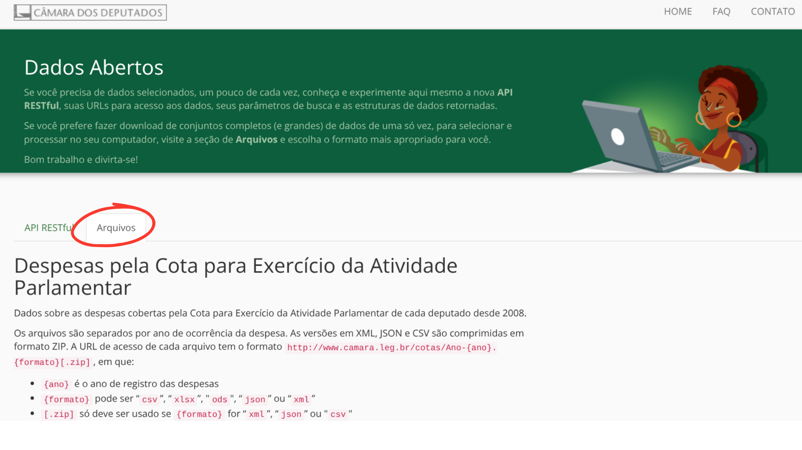
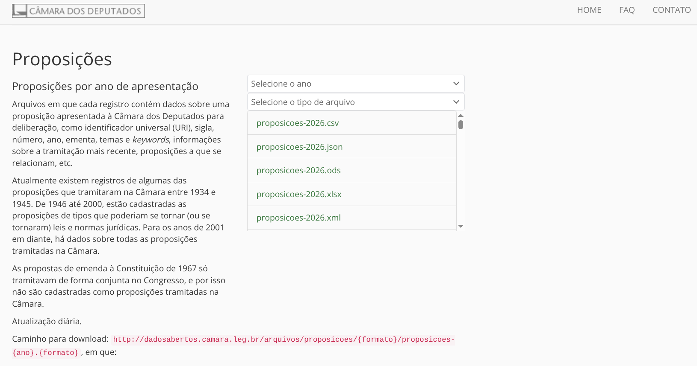
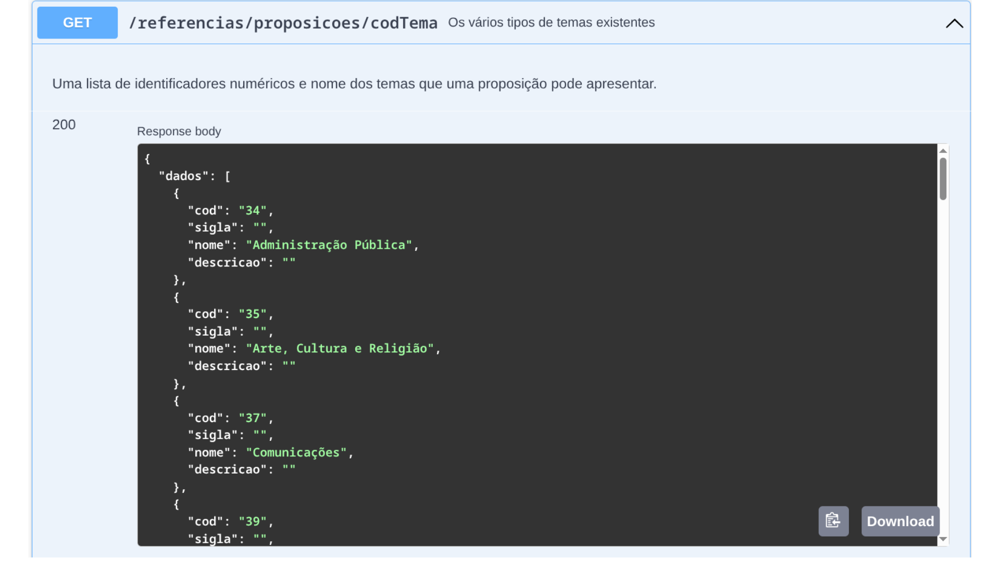
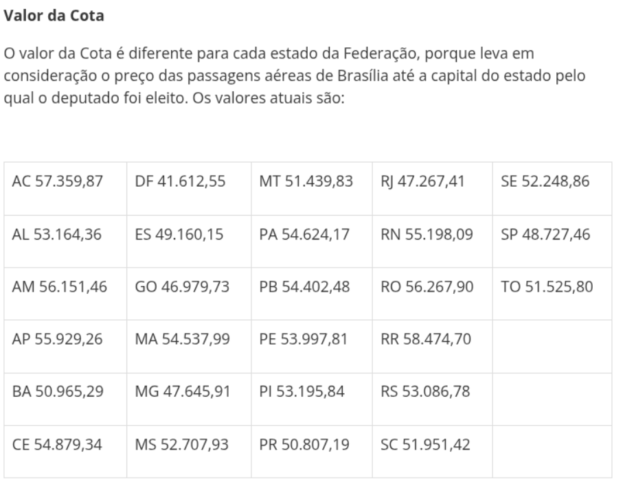

## Projeto Radar Cidadão e Ranking dos Deputados

Como parte da API (Aprendizagem por Projeto Integrador) do 1º semestre do curso de Desenvolvimento de Software Multiplataforma, criamos o Índice Geral de Desempenho (IGD), que calcula, baseado nos dados fornecidos pela API da Câmara dos Deputados, o desempenho dos Deputados em notas que variam de 0 a 10.

Neste documento apresento o passo a passo da criação da fórmula.

Primeiro é preciso dizer que esta foi, ao meu ver, a parte mais trabalhosa e empolgante de todo o projeto. Começamos a trabalhar na fórmula desde a primeira sprint, sendo concluída apenas na terceira e com tantos ajustes que a fórmula final é, provavelmente, a vigésima versão da fórmula. Também gostaria de acrescentar que sabemos que ainda há muito a ser melhorado e que existem plataformas que fazem o cálculo de desempenho dos deputados usando outras métricas. Contudo, essa foi a melhor versão que encontramos - considerando o tempo limitado, o fato de que podíamos somente usar os dados da API da Câmara dos Deputados e que este foi nosso primeiro projeto (do qual me orgulho muito!).

O projeto foi desenvolvido pela Equipe Lumina, composta por:

- Cid Neves (Dev Team)
- Daiane Santos (Product Owner)
- Guilherme Ribeiro (Dev Team)
- Guilherme de Siqueira (Dev Team)
- Gustavo de Oliveira (Dev Team)
- Julia Carolina Inácio (Dev Team)
- Kelwin Silva (Scrum Master)
- Pamela Iwabuchi (Dev Team)
- Vinicius de Souza (Dev Team)

[Github do projeto](https://github.com/APILumina/API1_DSM_Lumina)

*O Radar Cidadão é uma iniciativa totalmente independente desenvolvida por estudantes do curso de Desenvolvimento de Software Multiplataforma (DSM) da FATEC de São José dos Campos.
O projeto funciona sem qualquer tipo de filiação partidária, ideologia política ou apoio a candidatos ou recebimento de verbas governamentais, financiamento de políticos ou dinheiro público. Todos os dados utilizados são extraídos diretamente da API oficial da Câmara dos Deputados.*

Por fim, se você tiver dúvidas ou quiser aprofundar no assunto, não hesite em nos contatar!

Agora vamos ao que interessa:

Temos alguns passos para poder chegar á nota final:

1. Definir e inserir no banco de dados Pesos para tema, autor, tipo e status de projeto;
2. Cálculo de Gastos e economia;
3. Cálculo de proposição;
4. Verificar bônus de economia, projeto concluído ou comissões;
5. Cálculo final de desempenho.

## Fórmulas - Visão Geral

O cálculo final é realizado em duas etapas. Primeiro calculamos a nota relacionada a **proposições**:

Score_proposições = (0,4 × Peso_tema) + (0,3 × Peso_tipo) + (0,2 × Peso_status) + (0,1 × Peso_grau)

Onde:

- Tema representa 40% da nota de Proposições - define a relevância do trabalho para a sociedade.
- Tipos representa 30% da nota de Proposições - define a complexidade, nosso sistema reconhece que propor uma PEC (Proposta de Emenda da Constituição) exige mais capital político e técnico do que uma Assinatura de Ata, por exemplo.
- Status representa 20% da nota de Proposições - recompensa o avanço.
- Grau de Autoria representa 10% da nota de Proposições - recompensa quem liderou a proposta.

Com a nota de Proposições, podemos usar a fórmula de **Nota final**:

Score Final = (0,3 × Presença) + (0,7 × Proposição) + Bônus

Onde:

- Produção Legislativa/Proposições  (representa 70% da nota final): O foco principal é o que o deputado entrega (Projetos/Proposições).
- Presença  (representa 30% da nota final): O compromisso básico de estar nas sessões.
- Bônus de Economia (representa até 1.0 ponto de bônus na nota final): Quanto mais ele economiza, maior será ao bônus.
- Bônus de Cargos em Comissão (representa até 1.0 ponto de bônus na nota final).
- Bônus de Projeto aprovado (representa até 0.5 ponto de bônus na nota final).

**Dica sobre a API**

Como são muitos dados e uma quantidade absurda de proposições, pegar os dados direto pelos arquivos em formato csv que a câmara disponibiliza é uma excelente opção pra poupar tempo. Descendo mais a tela você encontra arquivos relacionando temas e autores também.




### Temas das Proposições

Em relação à temas, utilizamos a Constituição Federal de 1988 como parâmetro para a definição de peso dos temas. Nos baseamos nos artigos 5º e 6º da Constituição, que tratam sobre os direitos sociais fundamentais, como base para definirmos os temas com maior peso. O artigo 6º obriga o estado a criar políticas públicas para garantir o bem-estar e a dignidade do povo.

*Art. 5º Todos são iguais perante a lei, sem distinção de qualquer natureza, garantindo-se aos brasileiros e aos estrangeiros residentes no País a inviolabilidade do direito à vida, à liberdade, à igualdade, à segurança e à propriedade [...]*

*Art. 6º São direitos sociais a educação, a saúde, a alimentação, o trabalho, a moradia, o transporte, o lazer, a segurança, a previdência social, a proteção à maternidade e à infância, a assistência aos desamparados, na forma desta Constituição.*

Logo, projetos que tratam de direitos fundamentais (como Saúde e Segurança) recebem peso máximo (1.0). Temas que não constam nos artigos 5 e 6, mas constam na Constituição recebem peso 0.5, pois estão sujeitos aos artigos 5 e 6, assim entendemos que há uma hierarquia e que seu peso e impacto na vida do cidadão é menor. Por fim, atos simbólicos e meramente administrativos que nem sequer são citados na constituição recebem nota menor de 0.01.

| **Categoria de Peso**                           | **Base Legal (CF/88)**                                                                                                                              | **Temas da Câmara (Exemplos)**                                                                                                                                                                                                                                                                                                                                                                                                                                                                                                                                                                                                                                                                                                      |
| ----------------------------------------------- | --------------------------------------------------------------------------------------------------------------------------------------------------- | ----------------------------------------------------------------------------------------------------------------------------------------------------------------------------------------------------------------------------------------------------------------------------------------------------------------------------------------------------------------------------------------------------------------------------------------------------------------------------------------------------------------------------------------------------------------------------------------------------------------------------------------------------------------------------------------------------------------------------------- |
| **Crítico (1.0)**                               | Art. 5º e 6º: Direitos Individuais e Sociais (Vida, Saúde, Segurança, Educação, Trabalho, Alimentação, Transporte, Direitos Humanos).               | 39 (Esporte e Lazer), 44 (Direitos Humanos e Minorias), 46 (Educação), 52 (Previdência e Assistência Social), 56 (Saúde), 57 (Defesa e Segurança), 58 (Trabalho e Emprego), 61 (Viação, Transporte e Mobilidade), 64 (Agricultura, Pecuária, Pesca e Extrativismo), 67 (Direito e Defesa do Consumidor).                                                                                                                                                                                                                                                                                                                                                                                                                            |
| **Constitucional Geral (0.5)**                  | Citados no texto da CF/88, mas fora do núcleo dos Art. 5º e 6º (Organização do Estado, Ordem Econômica, Tributação, Ciência e Pesquisa - Art. 218). | 34 (Administração Pública), 35 (Arte, Cultura e Religião), 37 (Comunicações), 40 (Economia), 41 (Cidades e Desenvolvimento Urbano), 42 (Direito Civil e Processual Civil), 43 (Direito Penal e Processual Penal), 48 (Meio Ambiente e Desenvolvimento Sustentável), 51 (Estrutura Fundiária), 53 (Processo Legislativo e Atuação Parlamentar), 54 (Energia, Recursos Hídricos e Minerais), 55 (Relações Internacionais e Comércio Exterior), 60 (Turismo), 62 (Ciência, Tecnologia e Inovação), 66 (Indústria, Comércio e Serviços), 68 (Direito Constitucional), 70 (Finanças Públicas e Orçamento), 74 (Política, Partidos e Eleições), 76 (Direito e Justiça), 85 (Ciências Exatas e da Terra), 86 (Ciências Sociais e Humanas). |
| **Não Citados / Sem Peso Constitucional (0.1)** | Atos Simbólicos, ritos honoríficos e datas comemorativas sem previsão de alteração em direitos ou deveres.                                          | 72 (Homenagens e Datas Comemorativas).                                                                                                                                                                                                                                                                                                                                                                                                                                                                                                                                                                                                                                                                                              |
### Tipos de Proposição

As proposições variam de PL (Projeto de Lei),  PEC (Proposta de Emenda à Constituição) à AA (Assinatura de Ata) ou RP (Retirada de pauta), por exemplo. No total são 544 tipos de proposição fornecidas pela API da Câmara dos Deputados. Levamos isso em consideração na atribuição de notas.

Dividimos em 5 grandezas, separando por complexidade e dificuldade administrativa, sendo itens meramente administrativos e de mínima complexidade com peso 0.1.

| Categoria de Peso      | Parâmetros de Complexidade e Dificuldade Administrativa                                                     | Exemplos e Descrições dos Códigos                                                                                                     |
| :--------------------- | :---------------------------------------------------------------------------------------------------------- | :------------------------------------------------------------------------------------------------------------------------------------ |
| **Soberano (1.0)**     | **Impacto Nacional Máximo:** Altera a estrutura jurídica do país. Exige quórum qualificado e rito rigoroso. | **PEC:** Proposta de Emenda à Constituição; **PLP:** Projeto de Lei Complementar                                                      |
| **Legislativo (0.8)**  | **Alta Complexidade Normativa:** Criação ou alteração de leis federais. Impacto direto na sociedade.        | **PL:** Projeto de Lei; **MPV:** Medida Provisória; **PLN:** Plano de Lei Orçamentária; **PDL / PDC:** Projeto de Decreto Legislativo |
| **Fiscalização (0.5)** | **Média Complexidade Externa:** Instrumentos para vigiar o Poder Executivo e órgãos federais.               | **RIC:** Requerimento de Informação; **PFC:** Proposta de Fiscalização e Controle; **RCP:** Requerimento de CPI                       |
| **Regulatório (0.3)**  | **Baixa Complexidade Externa / Alta Interna:** Normas que regem o funcionamento da própria Casa.            | **PRC:** Projeto de Resolução da Câmara; **PRN:** Projeto de Resolução do Congresso Nacional                                          |
| **Acessório (0.1)**    | **Mínima Complexidade:** Atos procedimentais, sugestões, emendas ou expedientes de rotina.                  | **REQ:** Requerimentos; **INC:** Indicação; **SUG:** Sugestão Legislativa; **EMC/EMP:** Emendas; **SBT:** Substitutivos               |
### Grau de Autoria

Para o proponente principal do projeto a nota é 1.0. Se ele participou como coautor/apoiador, a nota é 0.5. Reconhecemos o esforço de quem é o idealizador, responsável jurídico e negociador político, por isso ele recebe uma nota maior.

| Valor na Coluna `proponente` | Papel do Parlamentar     | Multiplicador de Peso | Descrição Administrativa                                                                                              |
| :--------------------------- | :----------------------- | :-------------------- | :-------------------------------------------------------------------------------------------------------------------- |
| **1**                        | **Proponente Principal** | **1.0**               | Autor primário ou primeiro signatário. Detém o controlo jurídico e a paternidade oficial da proposição.               |
| **0**                        | **Coautor / Apoiador**   | **0.5**               | Parlamentar que assinou em conjunto. Representa apoio político, mas sem a responsabilidade principal pela tramitação. |

### Status da Proposição

| Categoria                  | Peso | Significado e Impacto no Rito Legislativo                                                                                           | Códigos Oficiais da API da Câmara                          |
| :------------------------- | :--- | :---------------------------------------------------------------------------------------------------------------------------------- | :--------------------------------------------------------- |
| **Concluído Positivo**     | 1.0  | **Sucesso Máximo:** A matéria venceu todas as etapas de votação e deliberação, sendo integrada com sucesso ao ordenamento jurídico. | 98, 114, 925, 928, 929, 930, 931                           |
| **Em Tramitação Avançada** | 0.8  | **Fase Final:** Projetos prontos para votação em Plenário, aprovados em fases cruciais ou enviados para revisão na outra Casa.      | 914, 915, 916, 919, 924, 926, 927, 932, 934, 941           |
| **Em Tramitação Inicial**  | 0.5  | **Fase de Instrução:** Projetos ativos tramitando regularmente dentro das comissões temáticas e recebendo pareceres.                | 907, 908, 909, 910, 911, 912, 913, 935, 936, 937, 938, 940 |
| **Aguardando Andamento**   | 0.3  | **Limbo Burocrático:** Matérias travadas em triagem inicial, aguardando despachos da Mesa, publicações ou apensadas.                | 901, 902, 903, 904, 905, 906, 917, 918, 933, 939           |
| **Concluído Negativo**     | 0.05 | **Fim da Linha (Sem Sucesso):** Projetos rejeitados, arquivados, retirados pelo autor ou vetados pelo Poder Executivo.              | 32, 134, 920, 921, 922, 923, 942, 943                      |

## Códigos para definição de pesos e explicação detalhada

### Peso dos temas:

Primeiro criamos uma tabela de referência chamada `temas_proposicoes` com os temas e pesos. É ela que usaremos para percorrer cada proposição e alocar as notas.

A API retorna os temas de cada proposição tanto com o nome quanto com o código. Para evitar erros relacionados à acentuação ou uso de maiúsculas e minúsculas, optamos por usar os códigos dos temas.



```python
try:
    cursor.close()
except Exception:
    pass

cursor = conn.cursor(buffered=True)

pesos_temas_completos = {
    '39': 1.0, '44': 1.0, '46': 1.0, '52': 1.0, '56': 1.0, '57': 1.0, '58': 1.0, '61': 1.0, '64': 1.0, '67': 1.0,
    '34': 0.5, '35': 0.5, '37': 0.5, '40': 0.5, '41': 0.5, '42': 0.5, '43': 0.5, '48': 0.5, '51': 0.5, '53': 0.5,
    '54': 0.5, '55': 0.5, '60': 0.5, '62': 0.5, '66': 0.5, '68': 0.5, '70': 0.5, '74': 0.5, '76': 0.5, '85': 0.5,
    '86': 0.5, '72': 0.1
}

NOME_TABELA = "Lumina2.tema_proposicoes"
COLUNA_ID = "cd_tema"
COLUNA_PESO = "peso"

dados_update = []
for id_tema, peso in pesos_temas_completos.items():
    id_inteiro = int(id_tema)
    tupla_formatada = (peso, id_inteiro)
    dados_update.append(tupla_formatada)

try:
    query_update = f"""
        UPDATE {NOME_TABELA}
        SET {COLUNA_PESO} = %s
        WHERE {COLUNA_ID} = %s
    """
    print(f"Iniciando a atualização em lote na tabela '{NOME_TABELA}'...")
    cursor.executemany(query_update, dados_update)
    conn.commit()

    print(f" Sucesso! Foram processadas {cursor.rowcount} linhas no banco de dados.")

except mysql.connector.Error as erro:
    print(f"\n [FALHA] Ocorreu um erro técnico durante a operação no banco:")
    print(f"Detalhes do erro: {erro}")
    conn.rollback()
finally:
    cursor.close()
```

Com a tabela de pesos criada, podemos percorrer cada proposição e alocar a pontuação relacionada ao tema (isso é feito no código da fórmula de proposições) .

### Peso dos status:

``` python
# Mapeamento de Códigos da API da Câmara para Pesos em Status

PESOS_SITUACAO = {
    # CONCLUÍDO POSITIVO (1.0)
    98: 1.0,   # Mapeamento Histórico / Concluída com sucesso
    114: 1.0,  # Mapeamento Histórico / Aprovada
    925: 1.0,  # Tramitando em Conjunto
    928: 1.0,  # Aguardando Análise de Parecer
    929: 1.0,  # Aguardando Redação Final
    930: 1.0,  # Enviada ao Arquivo
    931: 1.0,  # Aguardando Remessa ao Arquivo
    1140: 1.0, # Transformado em Norma Jurídica
    1230: 1.0, # Transformado em nova proposição
    1285: 1.0, # Tramitação Finalizada
    1299: 1.0, # Enviada ao Congresso Nacional
    1303: 1.0, # Enviada ao Senado Federal

    # EM TRAMITAÇÃO AVANÇADA (0.8)
    900: 0.8,  # Aguardando Autógrafos na Mesa
    914: 0.8,  # Aguardando Originais para Envio ao Arquivo
    915: 0.8,  # Aguardando Parecer
    916: 0.8,  # Aguardando Deliberação de Recurso
    924: 0.8,  # Pronta para Pauta
    926: 0.8,  # Aguardando Apreciação pelo Senado Federal
    927: 0.8,  # Aguardando Apensação
    932: 0.8,  # Aguardando Definição Encaminhamento
    934: 0.8,  # Aguardando despacho de Emenda
    941: 0.8,  # Recusado
    1070: 0.8, # Aguardando Envio ao Executivo
    1150: 0.8, # Aguardando Sanção
    1160: 0.8, # Aguardando Remessa à Sanção
    1270: 0.8, # Aguardando Envio à Redação Final
    1293: 0.8, # Aguardando Envio ao Senado Federal
    1294: 0.8, # Aguardando Promulgação
    1300: 0.8, # Aguardando Leitura do Parecer da Comissão Especial
    1301: 0.8, # Aguardando Interstício Regimental
    1305: 0.8, # Enviada ao TCU

    # EM TRAMITAÇÃO INICIAL (0.5)
    907: 0.5,  # Aguardando Designação de Relator(a)
    908: 0.5,  # Mapeamento Histórico / Em comissão (Inicial)
    909: 0.5,  # Mapeamento Histórico / Aguardando parecer em comissão
    910: 0.5,  # Aguardando Encaminhamento
    911: 0.5,  # Aguardando Instalação de Comissão Temporária
    912: 0.5,  # Aguardando Leitura e Publicação
    913: 0.5,  # Mapeamento Histórico / Publicada
    935: 0.5,  # Aguardando despacho de Substitutivo
    936: 0.5,  # Aguardando Providências Internas
    937: 0.5,  # Vetado totalmente
    940: 0.5,  # Aguardando Despacho de Arquivamento
    1000: 0.5, # Aguardando Recebimento para Publicação - Relatadas
    1030: 0.5, # Aguardando Informações do DCD - Relatadas
    1050: 0.5, # Aguardando análise de prazo recursal
    1052: 0.5, # Aguardando Abertura de Prazo para Recurso
    1060: 0.5, # Encaminhada à Publicação
    1090: 0.5, # Aguardando Análise
    1091: 0.5, # Ag. Análise de Inconstitucionalidade
    1280: 0.5, # Commission em funcionamento
    1295: 0.5, # Aguardando Reformulação de Parecer
    1297: 0.5, # Aguardando Parecer da Comissão Especial
    1298: 0.5, # Aguardando Manifestação do(a)(s) Acusado(a)(s)
    1310: 0.5, # Em tramitação no Conselho de Ética
    1313: 0.5, # Aguardando Parecer Preliminar no Conselho de Ética
    1314: 0.5, # Aguardando Defesa Escrita no Conselho de Ética
    1355: 0.5, # Em Instrução Probatória
    1380: 0.5, # Aguardando Elaboração do Parecer pelo(a) Relator(a)

    # AGUARDANDO ANDAMENTO (0.3)
    901: 0.3,  # Aguardando Constitution de Comissão Temporária
    902: 0.3,  # Aguardando Criação de Comissão Temporária
    903: 0.3,  # Aguardando Deliberação
    904: 0.3,  # Aguardando Deliberação de Recurso
    905: 0.3,  # Aguardando Despacho do Presidente da Câmara dos Deputados
    906: 0.3,  # Aguardando Distribuição
    917: 0.3,  # Aguardando Recebimento
    918: 0.3,  # Aguardando Recurso
    933: 0.3,  # Aguardando Conhecimento
    939: 0.3,  # Aguardando Apreciação do Veto
    1010: 0.3, # Aguardando Informações do DCD - Novas
    1020: 0.3, # Aguardando Encaminhamento à Publicação
    1040: 0.3, # Aguardando Encaminhamento à CCP para Publicação
    1080: 0.3, # Aguardando Recebimento para Publicação - Novas
    1097: 0.3, # Triagem de Documentos Internos
    1098: 0.3, # Processamento de Proposições Similares
    1110: 0.3, # Aguardando Despacho do Presidente
    1170: 0.3, # Aguardando Designação - Devolução de Relator(a) que deixou de ser Membro
    1180: 0.3, # Aguardando Apoiamento - Conferência de Assinaturas
    1185: 0.3, # Aguardando Apoiamento - Coleta de Assinaturas
    1200: 0.3, # Aguardando Autorização do Despacho
    1201: 0.3, # Aguardando Despacho do Presidente da Câmara dos Deputados (Chancela)
    1210: 0.3, # Aguardando Chancela e Publicação do Despacho
    1220: 0.3, # Aguardando Despacho do Presidente da Câmara dos Deputados (Análise)
    1221: 0.3, # Aguardando Despacho do Presidente da Câmara dos Deputados (Autorização)
    1223: 0.3, # Aguardando Despacho - Requerimentos
    1290: 0.3, # Aguardando Indexação
    1291: 0.3, # Aguardando Indexação (Substituição de Versão)
    1296: 0.3, # Aguardando Eleição do(a) Presidente da Comissão Especial e do(a) Relator(a)
    1302: 0.3, # Aguardando Publicação
    1304: 0.3, # Aguardando Solicitação de Relatoria na CMO
    1311: 0.3, # <Não Definido>
    1312: 0.3, # Aguardando Instauração do Processo
    1350: 0.3, # Aguardando Notificação do(a) Representado(a)
    1381: 0.3, # Aguardando análise do Presidente da Câmara - (Decisão)
    1382: 0.3, # Aguardando Despacho do Presidente da Câmara dos Deputados
    1383: 0.3, # Recebido pelo Protocolo Digital

    # CONCLUÍDO NEGATIVO (0.05)
    32: 0.05,  # Mapeamento Histórico / Rejeitada
    134: 0.05, # Mapeamento Histórico / Arquivada definitivamente
    920: 0.05, # Aguardando Deliberação sobre Prejudicialidade
    921: 0.05, # Aguardando Resposta
    922: 0.05, # Aguardando Vistas
    923: 0.05, # Arquivada
    942: 0.05, # Mapeamento Histórico / Retirada pelo autor antiga
    943: 0.05, # Mapeamento Histórico / Inativa antiga
    950: 0.05, # Retirado pelo(a) Autor(a)
    1120: 0.05,# Devolvida ao(à) Autor(a)
    1222: 0.05,# Prejudicialidade
    1250: 0.05,# Inativa Sinopse (Carga Jan/2001)
    1260: 0.05,# Desmembrada
    1292: 0.05,# Perdeu a Eficácia
    1360: 0.05, # Tramitação Suspensa
    0: 0.05  # Sem Situação Cadastrada / Dados Legados Neutros
}

try:
    #transforma o dicionário em uma lista organizada para o SQL: (peso, cod_situacao)
    lote_dados = [(peso, cod) for cod, peso in PESOS_SITUACAO.items()]

    query = "UPDATE proposicoes SET peso_status = %s WHERE codSituacao = %s;"
    cursor.executemany(query, lote_dados)

    conn.commit()
    print(f"Sucesso! {cursor.rowcount} linhas foram atualizadas.")

except Exception as erro:
    print(f"Erro: {erro}")
```

### Peso dos tipos:

``` python
# Mapeamento de Códigos da API da Câmara para Pesos em Tipo

PESOS_CODIGOS_SUPERIORES = {
    # PESO 1.0 (Impacto Constitucional e Estrutural Máximo)
    139: 1.0,  # PEC (Proposta de Emenda à Constituição)
    140: 1.0,  # PLP (Projeto de Lei Complementar)

    # PESO 0.8 (Leis Ordinárias, Decretos e Medidas de Alto Impacto)
    141: 0.8,  # PL (Projeto de Lei)
    291: 0.8,  # MPV (Medida Provisória)
    142: 0.8,  # PLN (Projeto de Lei Orçamentária)
    143: 0.8,  # PDL (Projeto de Decreto Legislativo)
    144: 0.8,  # PDC (Projeto de Decreto Legislativo de Concessão)

    # PESO 0.5 (Instrumentos de Fiscalização, Controle e Investigação)
    145: 0.5,  # RIC (Requerimento de Informação)
    146: 0.5,  # PFC (Proposta de Fiscalização e Controle)
    147: 0.5,  # RCP (Requerimento de Criação de CPI)

    # PESO 0.3 (Regimentos e Resoluções de Impacto Interno)
    148: 0.3,  # PRC (Projeto de Resolução da Câmara dos Deputados)
    149: 0.3   # PRN (Projeto de Resolução do Congresso Nacional)
}

NOME_TABELA = "tipo_peso"
COLUNA_ID = "cd_tipo"
COLUNA_PESO = "peso"

try:
    print("1. Buscando todos os IDs existentes na tabela...")
    # Busca apenas a coluna de IDs para saber quem precisa ser atualizado
    query_select = f"SELECT {COLUNA_ID} FROM {NOME_TABELA};"
    cursor.execute(query_select)
    todos_os_ids = [linha[0] for linha in cursor.fetchall()]

    dados_update = []

    for id_tipo in todos_os_ids:
        peso_final = PESOS_CODIGOS_SUPERIORES.get(id_tipo, 0.10)

        # Organiza na ordem do SQL: (peso, cd_tipo)
        dados_update.append((peso_final, id_tipo))

    print(f"2. Iniciando a atualização em lote de {len(dados_update)} registros...")
    query_update = f"""
        UPDATE {NOME_TABELA}
        SET {COLUNA_PESO} = %s
        WHERE {COLUNA_ID} = %s;
    """

    cursor.executemany(query_update, dados_update)
    conn.commit()

    print(f"Sucesso! {cursor.rowcount} linhas tiveram seus pesos alterados.")

except Exception as erro:
    print(f"\n[FALHA] Erro durante o processamento: {erro}")
```

### Peso de autoria:

Como só existem duas possibilidades (Proponente - 1 ou Co-autor - 0), no próprio banco rodamos uma query e criamos uma nova coluna com o valor de 1.0 para quem é autor e 0.5 para quem é co-autor.

## Fórmula de Proposições detalhada
### Score Presença

Para o calculo da nota de presenca, usamos um arquivo csv com os dados sobre as reunioes/votacoes em que os deputados deveriam estar presentes e em quantas reunioes/votacoes eles realmente foram. Usamos esse dado pra calcular a presenca - infelizmente o arquivo csv foi perdido ao decorrer das sprints - o código abaixo apenas transforma o valor obtido para decimal, mas deixo em caso de curiosidade.

``` python
cursor = conn.cursor()

query_select = """
SELECT t.fk_deputado, t.taxa_assiduidade
FROM taxa_presenca t
JOIN deputado d ON t.fk_deputado = d.cd_deputado
"""
cursor.execute(query_select)
dados = cursor.fetchall()

query_insert = "INSERT INTO desempenho (fk_deputado, score_presenca) VALUES (%s, %s)"

for (id_dep, taxa_assiduidade) in dados:
    valor_dividido = taxa_assiduidade / 100
    try:
        cursor.execute(query_insert, (id_dep, valor_dividido))
    except mysql.connector.Error as err:
        print(f"Pulei o deputado {id_dep} devido ao erro: {err}")

conn.commit()
cursor.close()

```
### Score Gastos

Com a permissão do professor, usamos dados deste site para informacoes sobre a cota parlamentar:
https://www2.camara.leg.br/comunicacao/assessoria-de-imprensa/guia-para-jornalistas/cota-parlamentar

Dessa forma, podemos avaliar o valor gasto ou economizado por deputado e usamos essa informacao para adicionar um bonus a sua nota. Quanto mais ele economiza, maior é o bonus.



``` python

cursor = conn.cursor()

query_select = "SELECT fk_deputado, despesa_total, economia FROM economia"
cursor.execute(query_select)
dados_economia = cursor.fetchall()

query_update = "UPDATE desempenho SET score_gastos = %s WHERE fk_deputado = %s"

for (id_dep, despesa, economia) in dados_economia:
    total_geral = despesa + economia

    if total_geral > 0:
        score_gastos = (economia / total_geral)

        # Garante que não fique negativo (se gastou mais que o teto, fica 0)
        score_gastos = max(0, score_gastos)
    else:
        score_gastos = 0

    cursor.execute(query_update, (score_gastos, id_dep))

conn.commit()
cursor.close()

print("Coluna score_gastos atualizada com sucesso!")

```


### Fórmula para Cálculo de Proposições

O Cálculo foi dividido em 2 partes: score de proposição e o cálculo final. Aqui calculamos a nota de cada projeto individualmente. Como cada deputado pode ter (e tem!) mais de 1 projeto, precisamos somar as quantidades de projetos totais que cada deputado tem para ter a média da nota final dos projetos.

Dica: Uma coisa que aprendemos errando foi não padronizar as colunas, ou seja, usamos `fk_deputado` em uma tabela e na outra `id_deputado`. Isso dificultou muito a montagem do código, pois são muitas tabelas relacionadas e em um certo ponto, ficou confuso. Infelizmente quando percebemos esse erro, seria muito trabalhoso mudar todas as colunas das tabelas e padronizar, pois teríamos que mudar códigos que já estavam em funcionamento, e pelo prazo apertado e outras demandas deixamos de lado. Mas minha sugestão e aprendizagem é: padronize.

Criamos a tabela `desempenho` para centralizar as notas de presença, gastos, projetos e a nota final.

Projetos de datas e homenagens (tema 72 - que não são citados na constituição) são geralmente os tipos de projeto que possuem menos oposição e mais facilidade de aprovação. Como eles não são citados na constituição e a aprovação desses projetos pode inflar a nota dos deputados de forma a não levar em consideração projetos de impacto maior na sociedade, decidimos removê-los da nota.

`WHEN m.volume_valido <=3 THEN 0.0` - Deputados com 3 ou menos projetos recebem a nota 0. Isso impede que autores de um único projeto aprovado assumam o topo do ranking.

`WHEN m.volume_valido < 112 THEN m.media_pura * (m.volume_valido / 112.0)` - A mediana de projetos é 112. Aqui avaliamos também a quantidade de projetos propostos. Usamos 112 como parâmetro de controle, ou seja, deputados que produziram abaixo da mediana da câmara sofrem um ajuste proporcional na nota final, enquanto os deputados que atingem ou ultrapassam a marca de 112 pontuam integralmente. Essa é uma solução para penalizar quantidade e evitar que um deputado com apenas 5 ou 10 projetos muito bem avaliados fique empatado no topo com quem produziu 150 projetos com a mesma qualidade.

``` python

try:
    # 1. Calcula o score de cada projeto individualmente
    query_update_score = """
        UPDATE Lumina2.proposicao_deputados
        INNER JOIN Lumina2.proposicoes
            ON proposicao_deputados.fk_proposicao = proposicoes.cd_proposicoes
        LEFT JOIN Lumina2.tipo_peso
            ON proposicoes.fk_tipo = tipo_peso.cd_tipo
        LEFT JOIN Lumina2.tema_proposicoes
            ON proposicoes.cd_proposicoes = tema_proposicoes.id_proposicao
        LEFT JOIN Lumina2.tema_peso
            ON tema_proposicoes.id_tema = tema_peso.cd_tema
        SET proposicao_deputados.score_projetos = (
            (IFNULL(tema_peso.peso, 0.1) * 0.4) +
            (IFNULL(tipo_peso.peso, 0.1) * 0.3) +
            (IFNULL(proposicoes.peso_status, 0.1) * 0.2) +
            (IFNULL(proposicao_deputados.peso, 0.5) * 0.1)
        );
    """

    # 2. agrupa os projetos por deputado, exclui projetos com tema 72 (homenagens, datas) e calcula a média da nota de cada deputado
    query_projetos_unificados = """
        UPDATE Lumina2.desempenho d
        INNER JOIN (
            SELECT
                pd.fk_deputado,
                AVG(pd.score_projetos) AS media_pura,
                COUNT(DISTINCT pd.fk_proposicao) AS volume_valido
            FROM Lumina2.proposicao_deputados pd
            INNER JOIN Lumina2.tema_proposicoes tp ON pd.fk_proposicao = tp.id_proposicao
            WHERE pd.fk_deputado IS NOT NULL
              AND tp.id_tema <> 72
            GROUP BY pd.fk_deputado
        ) m ON d.fk_deputado = m.fk_deputado
        SET d.score_projetos = CASE
            WHEN m.volume_valido <= 3 THEN 0.0
            WHEN m.volume_valido < 112 THEN m.media_pura * (m.volume_valido / 112.0)
            ELSE m.media_pura
        END;
    """

    print("Processando cálculo do score_projetos...")
    cursor.execute(query_update_score)
    cursor.execute(query_projetos_unificados)

    conn.commit()
    print("score_projetos calculado e atualizado com sucesso na tabela desempenho!")

except mysql.connector.Error as erro:
    print(f"[ERRO NA EXECUÇÃO]: {erro}")
    conn.rollback()

```

### Fórmula para Cálculo Final

Agora com a nota de proposições, podemos calcular a nota final!

``` python
# Passo 2
# SCORE FINAL

try:
    cursor.close()
except Exception:
    pass
cursor = conn.cursor(buffered=True)

try:
    #(0.3 + 0.7 = 1.0) + Bônus
    query_calculo_lumina = """
        SELECT
            d.fk_deputado,

        -- 1. COMPONENTE BASE: PRESENÇA (Peso Original 0.3)
            (0.3 * IFNULL(d.score_presenca, 0.0)) AS componente_presenca,

        -- 2. COMPONENTE BASE: PROJETOS (Peso Original 0.7)
            (0.7 * IFNULL(d.score_projetos, 0.0)) AS componente_projetos,

        -- 3. BÔNUS DE GASTOS (Adicional de até 0.10)
            (0.10 * IFNULL(d.score_gastos, 0.0)) AS bonus_gastos,

        -- 4. BÔNUS DE APROVAÇÃO (Adicional de até 0.05)
            CASE
                WHEN ap.fk_deputado IS NOT NULL THEN 0.05
                WHEN av.fk_deputado IS NOT NULL THEN 0.02
                ELSE 0.0
            END AS bonus_aprovacao,

        -- 5. BÔNUS DE COMISSÃO / ÓRGÃO (Adicional de até 0.10)
            (0.10 * IFNULL(lid.maior_peso, 0.00)) AS bonus_orgao

        FROM Lumina2.desempenho d

        LEFT JOIN (
            SELECT DISTINCT pd.fk_deputado
            FROM Lumina2.proposicao_deputados pd
            INNER JOIN Lumina2.proposicoes p ON pd.fk_proposicao = p.cd_proposicoes
            INNER JOIN Lumina2.tema_proposicoes tp ON p.cd_proposicoes = tp.id_proposicao
            WHERE p.codSituacao IN (98, 114, 1140, 1230)
              AND tp.id_tema <> 72
              AND pd.fk_deputado IS NOT NULL
        ) ap ON d.fk_deputado = ap.fk_deputado

        LEFT JOIN (
            SELECT DISTINCT pd.fk_deputado
            FROM Lumina2.proposicao_deputados pd
            INNER JOIN Lumina2.proposicoes p ON pd.fk_proposicao = p.cd_proposicoes
            WHERE p.codSituacao IN (920, 924, 930, 1100, 1120)
              AND pd.fk_deputado IS NOT NULL
        ) av ON d.fk_deputado = av.fk_deputado

        LEFT JOIN (
            SELECT
                fk_deputado,
                MAX(peso_cargo) AS maior_peso
            FROM Lumina2.lideranca_orgaos
            GROUP BY fk_deputado
        ) lid ON d.fk_deputado = lid.fk_deputado;
    """

    cursor.execute(query_calculo_lumina)
    resultados_finais = cursor.fetchall()

    query_update_final = """
        UPDATE Lumina2.desempenho
        SET score_final = %s
        WHERE fk_deputado = %s
    """

    lote_updates = []
    for fk_deputado, comp_pres, comp_proj, b_gastos, b_aprov, b_orgao in resultados_finais:
        # Soma direta: Base (Máximo 1.0) + Bônus Extras (Máximo 0.25)
        score_total = float(comp_pres) + float(comp_proj) + float(b_gastos) + float(b_aprov) + float(b_orgao)

        # Se passar de 1.0 (Nota 10.0 no site), a função min corta e fecha em 1.0
        score_normalizado = max(0.0, min(1.0, score_total))
        lote_updates.append((score_normalizado, fk_deputado))

    if lote_updates:
        print(f" Gravando score_final consolidado para {len(lote_updates)} deputados...")
        cursor.executemany(query_update_final, lote_updates)
        conn.commit()
        print("Sucesso!")
    else:
        print("Nenhum registro modificado.")

except mysql.connector.Error as erro:
    print(f"\n[ERRO]: {erro}")
    conn.rollback()
finally:
    cursor.close()

```

Explicando algumas partes do código acima:

```
# nesta parte do código calculamos o bônus de projeto aprovado. Algumas categorias de status de projeto estão bem próximas da aprovação, e se já chegaram nesse estágio é porque já passaram por muitas validações e há grande probabilidade de serem aprovadas. Nesse caso o bônus em cima delas é de 0.02, e o bônus para as aprovadas é de 0.05

#Para saber se tem projetos aprovados (se são aprovados estao nas categorias 98,114,1140 ou 1230)
        LEFT JOIN (
            SELECT DISTINCT pd.fk_deputado
            FROM Lumina2.proposicao_deputados pd
            INNER JOIN Lumina2.proposicoes p ON pd.fk_proposicao = p.cd_proposicoes
            INNER JOIN Lumina2.tema_proposicoes tp ON p.cd_proposicoes = tp.id_proposicao
            WHERE p.codSituacao IN (98, 114, 1140, 1230)
              AND tp.id_tema <> 72
              AND pd.fk_deputado IS NOT NULL
        ) ap ON d.fk_deputado = ap.fk_deputado

#Aqui vemos se tem projetos perto de serem aprovados
LEFT JOIN (
            SELECT DISTINCT pd.fk_deputado
            FROM Lumina2.proposicao_deputados pd
            INNER JOIN Lumina2.proposicoes p ON pd.fk_proposicao = p.cd_proposicoes
            WHERE p.codSituacao IN (920, 924, 930, 1100, 1120)
              AND pd.fk_deputado IS NOT NULL
        ) av ON d.fk_deputado = av.fk_deputado


# Usamos essa informação no início do código na montagem da nota:
        -- 4. BÔNUS DE APROVAÇÃO (Adicional de até 0.05)
            CASE
                WHEN ap.fk_deputado IS NOT NULL THEN 0.05
                WHEN av.fk_deputado IS NOT NULL THEN 0.02
                ELSE 0.0
            END AS bonus_aprovacao,
```

Aqui finalizo o passo a passo para a criação da fórmula! Se você leu até aqui, obrigada pelo seu tempo! A fórmula foi uma parte muito importante do projeto e fico muito feliz de poder compartilhar!
